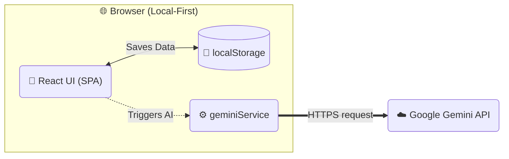
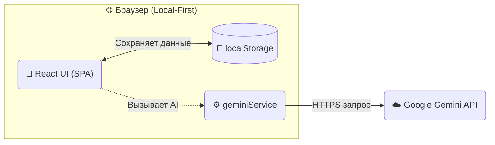

# 👻 FanTrack

**Your Universal Task Space — a local-first, privacy-focused tracker with AI superpowers.**

> 🇬🇧 [English](#-project-overview) · 🇷🇺 [Русский](#-обзор-проекта)

---

## 🇬🇧 English

---

## 📋 Project Overview

FanTrack is an offline-first, single-page web application for organizing everyday tasks, habits, shopping lists, travel checklists, and free-form notes. It features a modern glassmorphism UI with customizable themes, built-in AI assistant (Google Gemini), and full data import/export — all without a single server-side component.

### Key Highlights

| Feature                 | Description                                                                                   |
| ----------------------- | --------------------------------------------------------------------------------------------- |
| **5 Tracker Types**     | Shopping, Todo, Travel, Habits, Notes — each with type-specific UX                            |
| **Habit Calendar**      | Visual day-by-day grid + collapsible accordion view with bulk expand/collapse                 |
| **AI Assistant (BYOK)** | Generate shopping lists, workout plans, packing checklists, or entire notes via Google Gemini |
| **Themes & Patterns**   | 7 gradient themes (Synthwave, Deep Space, OLED Black, etc.) + 4 background patterns           |
| **Bilingual UI**        | Full Russian 🇷🇺 and English 🇬🇧 interface                                                      |
| **Backup & Restore**    | One-click JSON export/import of all trackers and settings                                     |
| **Built-in Calculator** | Quick calculations for shopping and travel budgets                                            |
| **Multi-Currency**      | Support for ₴ UAH, $ USD, € EUR, ₽ RUB, ₸ KZT                                                 |

---

## 🔐 Architecture & Privacy (Local-First)

FanTrack adopts a **strict local-first architecture**. There is no backend, no database, and no telemetry.



### What stays in your browser

- **All trackers & tasks** — stored under the `glass-trackers` localStorage key.
- **App settings** (theme, language, background pattern) — stored under `glass-settings`.
- **Your Gemini API key** — if provided, saved in `glass-settings.userApiKey`. It is **never** sent anywhere except directly to the Google Gemini API from **your** browser.

### When does network traffic occur?

Only when you explicitly use the **AI Suggest** feature. The request goes directly from your browser to the Google Gemini API (`generativelanguage.googleapis.com`). No proxy, no middleware.

> [!IMPORTANT]
> FanTrack has **zero server-side components**. Your data never leaves your machine unless you manually export it or invoke the AI assistant.

---

## 🛠 Tech Stack

| Layer          | Technology                                       | Version |
| -------------- | ------------------------------------------------ | ------- |
| **UI Library** | React                                            | 19.2    |
| **Language**   | TypeScript                                       | 5.8     |
| **Build Tool** | Vite                                             | 6.2     |
| **Styling**    | Tailwind CSS (CDN)                               | 3.x     |
| **Icons**      | Lucide React                                     | 0.564   |
| **AI**         | Google GenAI SDK (`@google/genai`)               | 1.41    |
| **State**      | React `useState` + custom `useLocalStorage` hook | —       |

> No state-management library (Redux, Zustand, etc.) is used — the app relies on React's built-in state combined with a generic `useLocalStorage` hook for persistence.

---

## 📂 Project Structure

```
fantrack/
├── index.html              # Entry HTML — Tailwind CDN, import map, custom styles
├── index.tsx               # React root mount (StrictMode)
├── App.tsx                 # Main application component — dashboard, routing, modals
├── types.ts                # TypeScript interfaces & enums (Tracker, Task, AppSettings)
├── constants.ts            # Theme configs, color palettes, currencies, icons, i18n strings
├── vite.config.ts          # Vite dev server (port 3000) + env variable mapping
├── tsconfig.json           # TypeScript compiler options
├── metadata.json           # App metadata
├── package.json            # Dependencies & scripts
│
├── components/
│   ├── TrackerCard.tsx      # Dashboard card — icon, progress bar, preview
│   ├── TrackerDetail.tsx    # Full tracker view — task CRUD, habit calendar, AI suggest, notes
│   ├── SettingsModal.tsx    # Settings panel — themes, patterns, language, API key, backup
│   ├── Calculator.tsx       # Floating calculator widget
│   └── ConfirmDialog.tsx    # Reusable confirmation modal
│
├── hooks/
│   └── useLocalStorage.ts   # Generic hook: syncs React state ↔ localStorage
│
└── services/
    └── geminiService.ts     # Google Gemini API integration — prompt construction & parsing
```

### Layer Responsibilities

| Layer              | Files                       | Purpose                                                  |
| ------------------ | --------------------------- | -------------------------------------------------------- |
| **Entry**          | `index.html`, `index.tsx`   | HTML shell, Tailwind CDN, React root                     |
| **App Shell**      | `App.tsx`                   | Dashboard grid, search/filter/sort, tracker CRUD, modals |
| **Components**     | `components/*`              | Isolated UI blocks (cards, detail views, dialogs)        |
| **Hooks**          | `hooks/useLocalStorage.ts`  | Persistence logic — read/write to `localStorage`         |
| **Services**       | `services/geminiService.ts` | External API calls — Google Gemini structured output     |
| **Types & Config** | `types.ts`, `constants.ts`  | Shared interfaces, enums, themes, translations           |

---

## ✨ Features in Detail

### 🛒 Shopping Tracker

- Items with **price** and **quantity** fields
- Automatic **sum calculation** with selectable currency
- Built-in **calculator** for quick math

### ✅ Todo Tracker

- Classic checkbox-based task list
- Search, sort (by date, name), and filter
- Hide/show completed items

### ✈️ Travel Tracker

- Packing checklist with budget tracking
- Currency selector (₴, $, €, ₽, ₸)

### 💪 Habit Tracker

- **Calendar Grid** — visual day-of-month heatmap
- **Collapse / Accordion view** — expand individual habits to mark days
- **Bulk management** — Expand All / Collapse All
- **Archive** — hide completed habits while preserving history

### 📝 Notes

- Free-form text editor
- AI can generate entire notes, recipes, or guides

### 🤖 AI Assistant (BYOK — Bring Your Own Key)

- Powered by **Google Gemini** (`gemini-3-flash-preview`)
- **Generate**: ask for a "Monthly Workout Plan" or "Lasagna Grocery List"
- **Smart Add**: AI-generated items are injected directly into your tracker
- Structured JSON output for reliable parsing
- Works in both **Russian** and **English**

### 🎨 Customization

- **7 Themes**: Synthwave, Deep Space, Ocean, Forest, Midnight, Volcano, OLED Black
- **4 Background Patterns**: Retro Grid, Hexagons, Dots, Waves (or None)
- **Icon Picker**: choose from 30+ Lucide icons per tracker
- **Color Picker**: 6 gradient presets per tracker card

### 💾 Backup & Restore

- **Export**: downloads a `.json` file with all trackers + settings
- **Import**: upload a previously exported `.json` to fully restore state (with confirmation dialog)

---

## 🤖 AI Setup

To enable AI suggestions:

1. Open **Settings** (⚙️ gear icon in the top-right corner).
2. Paste your **Google Gemini API Key** into the designated field.
   - Get a free key at [Google AI Studio](https://aistudio.google.com/).
3. The key is saved **only** in your browser's `localStorage`. It is sent **only** to the Gemini API when you use the AI Suggest feature.

> [!TIP]
> You can also set the key via the `GEMINI_API_KEY` environment variable in `.env.local` during local development.

---

## 🚀 Local Setup

### Prerequisites

- **Node.js** ≥ 18
- **npm** ≥ 9

### Installation

```bash
# 1. Clone the repository
git clone https://github.com/itsfantomas/fantrack.git
cd fantrack

# 2. Install dependencies
npm install

# 3. (Optional) Set up AI key for development
echo "GEMINI_API_KEY=your_key_here" > .env.local

# 4. Start the development server
npm run dev
```

The app will be available at **http://localhost:3000**.

### Available Scripts

| Command           | Description                          |
| ----------------- | ------------------------------------ |
| `npm run dev`     | Start Vite dev server on port 3000   |
| `npm run build`   | Build production bundle to `dist/`   |
| `npm run preview` | Preview the production build locally |

---

## 📄 License

This project is provided as-is for personal use.

---
---

## 🇷🇺 Русский

---

## 📋 Обзор проекта

FanTrack — это оффлайн-ориентированное одностраничное веб-приложение для организации повседневных задач, привычек, списков покупок, чеклистов для путешествий и свободных заметок. Приложение отличается современным glassmorphism-дизайном с настраиваемыми темами, встроенным AI-ассистентом (Google Gemini) и полным импортом/экспортом данных — и всё это без единого серверного компонента.

### Ключевые возможности

| Функция                    | Описание                                                                      |
| -------------------------- | ----------------------------------------------------------------------------- |
| **5 типов трекеров**       | Покупки, Задачи, Путешествия, Привычки, Заметки — каждый с уникальным UX      |
| **Календарь привычек**     | Визуальная сетка по дням + аккордеон с массовым развёртыванием/свёртыванием   |
| **AI-ассистент (BYOK)**    | Генерация списков покупок, планов тренировок, чеклистов через Google Gemini   |
| **Темы и паттерны**        | 7 градиентных тем (Synthwave, Deep Space, OLED Black и др.) + 4 фоновых узора |
| **Двуязычный интерфейс**   | Полная поддержка русского 🇷🇺 и английского 🇬🇧                                 |
| **Бэкап и восстановление** | Экспорт/импорт всех данных одним кликом в формате JSON                        |
| **Встроенный калькулятор** | Быстрые расчёты для покупок и бюджета путешествий                             |
| **Мультивалютность**       | Поддержка ₴ UAH, $ USD, € EUR, ₽ RUB, ₸ KZT                                   |

---

## 🔐 Архитектура и приватность (Local-First)

FanTrack использует **строгую локальную архитектуру**. Нет бэкенда, нет базы данных, нет телеметрии.



### Что хранится в вашем браузере

- **Все трекеры и задачи** — ключ `glass-trackers` в `localStorage`.
- **Настройки** (тема, язык, фоновый узор) — ключ `glass-settings`.
- **Ваш API-ключ Gemini** — если указан, сохраняется в `glass-settings.userApiKey`. Он **никогда** не отправляется куда-либо, кроме как напрямую в Google Gemini API из **вашего** браузера.

### Когда происходит сетевой трафик?

Только при явном использовании функции **AI Suggest**. Запрос идёт напрямую из вашего браузера к Google Gemini API (`generativelanguage.googleapis.com`). Без прокси, без промежуточного сервера.

> [!IMPORTANT]
> FanTrack не имеет **серверных компонентов**. Ваши данные никогда не покидают вашу машину, если вы сами не экспортируете их или не вызовете AI-ассистента.

---

## 🛠 Стек технологий

| Слой              | Технология                                         | Версия |
| ----------------- | -------------------------------------------------- | ------ |
| **UI-библиотека** | React                                              | 19.2   |
| **Язык**          | TypeScript                                         | 5.8    |
| **Сборщик**       | Vite                                               | 6.2    |
| **Стили**         | Tailwind CSS (CDN)                                 | 3.x    |
| **Иконки**        | Lucide React                                       | 0.564  |
| **AI**            | Google GenAI SDK (`@google/genai`)                 | 1.41   |
| **Состояние**     | React `useState` + кастомный хук `useLocalStorage` | —      |

> Сторонние библиотеки управления состоянием (Redux, Zustand и т.д.) не используются — приложение полагается на встроенный React state в сочетании с хуком `useLocalStorage` для персистенции.

---

## 📂 Структура проекта

```
fantrack/
├── index.html              # HTML-оболочка — Tailwind CDN, import map, кастомные стили
├── index.tsx               # React root mount (StrictMode)
├── App.tsx                 # Главный компонент — дашборд, роутинг, модалки
├── types.ts                # TypeScript интерфейсы и энамы (Tracker, Task, AppSettings)
├── constants.ts            # Конфигурация тем, палитр, валют, иконок, i18n
├── vite.config.ts          # Vite dev-сервер (порт 3000) + маппинг env-переменных
├── tsconfig.json           # Настройки компилятора TypeScript
├── metadata.json           # Метаданные приложения
├── package.json            # Зависимости и скрипты
│
├── components/
│   ├── TrackerCard.tsx      # Карточка дашборда — иконка, прогресс-бар, превью
│   ├── TrackerDetail.tsx    # Полный вид трекера — CRUD задач, календарь, AI, заметки
│   ├── SettingsModal.tsx    # Панель настроек — темы, паттерны, язык, API-ключ, бэкап
│   ├── Calculator.tsx       # Плавающий виджет калькулятора
│   └── ConfirmDialog.tsx    # Переиспользуемый диалог подтверждения
│
├── hooks/
│   └── useLocalStorage.ts   # Универсальный хук: синхронизация React state ↔ localStorage
│
└── services/
    └── geminiService.ts     # Интеграция с Google Gemini API — формирование промпта и парсинг
```

### Ответственности слоёв

| Слой              | Файлы                       | Назначение                                                 |
| ----------------- | --------------------------- | ---------------------------------------------------------- |
| **Точка входа**   | `index.html`, `index.tsx`   | HTML-оболочка, Tailwind CDN, React root                    |
| **Оболочка**      | `App.tsx`                   | Сетка дашборда, поиск/фильтр/сортировка, CRUD трекеров     |
| **Компоненты**    | `components/*`              | Изолированные UI-блоки (карточки, детальные вью, диалоги)  |
| **Хуки**          | `hooks/useLocalStorage.ts`  | Логика персистенции — чтение/запись в `localStorage`       |
| **Сервисы**       | `services/geminiService.ts` | Внешние API-вызовы — структурированный вывод Google Gemini |
| **Типы и конфиг** | `types.ts`, `constants.ts`  | Общие интерфейсы, энамы, темы, переводы                    |

---

## ✨ Подробности о функциях

### 🛒 Трекер покупок

- Товары с полями **цена** и **количество**
- Автоматический **подсчёт суммы** с выбором валюты
- Встроенный **калькулятор** для быстрых вычислений

### ✅ Трекер задач

- Классический список с чекбоксами
- Поиск, сортировка (по дате, имени), фильтрация
- Скрытие/показ выполненных задач

### ✈️ Трекер путешествий

- Чеклист для упаковки с отслеживанием бюджета
- Выбор валюты (₴, $, €, ₽, ₸)

### 💪 Трекер привычек

- **Календарная сетка** — визуальная тепловая карта по дням месяца
- **Аккордеон** — раскрытие отдельных привычек для отметки дней
- **Массовое управление** — кнопки «Развернуть все» / «Свернуть все»
- **Архив** — скрытие завершённых привычек с сохранением истории

### 📝 Заметки

- Свободный текстовый редактор
- AI может генерировать целые заметки, рецепты или руководства

### 🤖 AI-ассистент (BYOK — Bring Your Own Key)

- На базе **Google Gemini** (`gemini-3-flash-preview`)
- **Генерация**: запросите «План тренировок на месяц» или «Список продуктов для борща»
- **Умное добавление**: сгенерированные AI элементы добавляются прямо в ваш трекер
- Структурированный JSON-вывод для надёжного парсинга
- Работает на **русском** и **английском**

### 🎨 Кастомизация

- **7 тем**: Synthwave, Deep Space, Ocean, Forest, Midnight, Volcano, OLED Black
- **4 фоновых узора**: Retro Grid, Hexagons, Dots, Waves (или без узора)
- **Выбор иконки**: 30+ иконок Lucide для каждого трекера
- **Выбор цвета**: 6 градиентных пресетов для карточек

### 💾 Бэкап и восстановление

- **Экспорт**: скачивание `.json` файла со всеми трекерами и настройками
- **Импорт**: загрузка ранее экспортированного `.json` для полного восстановления (с диалогом подтверждения)

---

## 🤖 Настройка AI

Для включения AI-подсказок:

1. Откройте **Настройки** (⚙️ иконка шестерёнки в правом верхнем углу).
2. Вставьте ваш **Google Gemini API Key** в соответствующее поле.
   - Получите бесплатный ключ на [Google AI Studio](https://aistudio.google.com/).
3. Ключ сохраняется **только** в `localStorage` вашего браузера. Он отправляется **исключительно** в Gemini API при использовании функции AI Suggest.

> [!TIP]
> Вы также можете указать ключ через переменную окружения `GEMINI_API_KEY` в файле `.env.local` при локальной разработке.

---

## 🚀 Локальный запуск

### Требования

- **Node.js** ≥ 18
- **npm** ≥ 9

### Установка

```bash
# 1. Клонируйте репозиторий
git clone https://github.com/itsfantomas/fantrack.git
cd fantrack

# 2. Установите зависимости
npm install

# 3. (Опционально) Укажите AI-ключ для разработки
echo "GEMINI_API_KEY=ваш_ключ" > .env.local

# 4. Запустите dev-сервер
npm run dev
```

Приложение будет доступно по адресу **http://localhost:3000**.

### Доступные команды

| Команда           | Описание                              |
| ----------------- | ------------------------------------- |
| `npm run dev`     | Запуск Vite dev-сервера на порту 3000 |
| `npm run build`   | Сборка продакшн-бандла в `dist/`      |
| `npm run preview` | Предпросмотр продакшн-сборки локально |

---

## 📄 Лицензия

Проект предоставляется «как есть» для личного использования.
